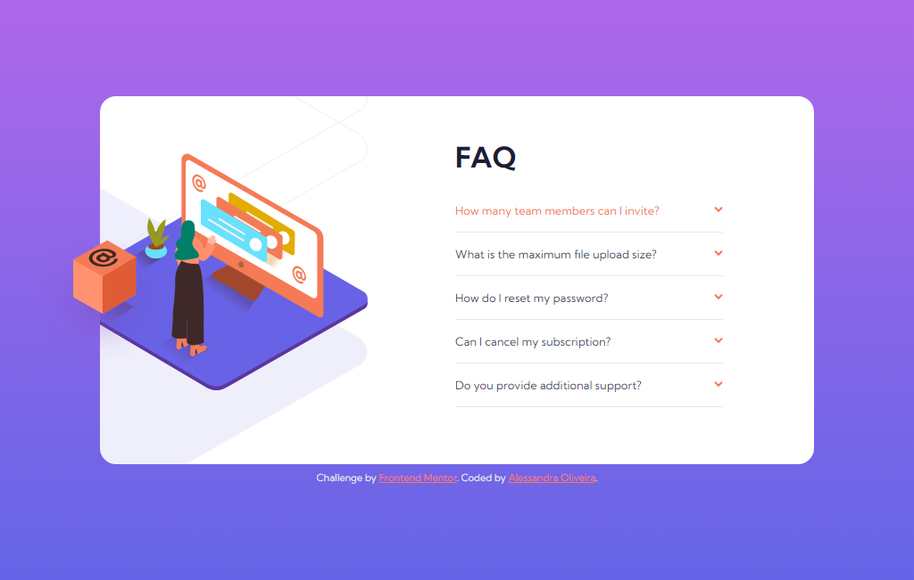
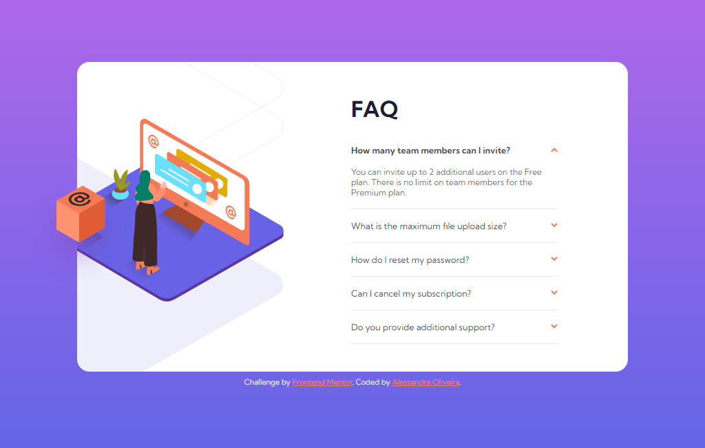
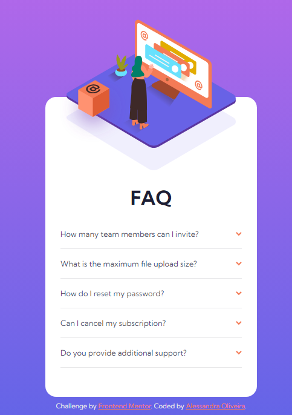
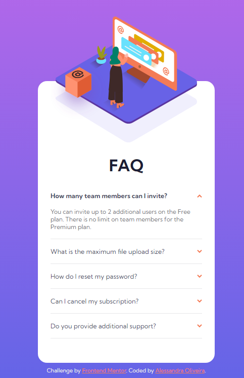

# Frontend Mentor - FAQ accordion card solution

This is a solution to the [FAQ accordion card challenge on Frontend Mentor](https://www.frontendmentor.io/challenges/faq-accordion-card-XlyjD0Oam).

## Table of contents

- [Overview](#overview)
  - [The challenge](#the-challenge)
  - [Screenshot](#screenshot)
  - [Links](#links)
- [My process](#my-process)
  - [Built with](#built-with)
- [Author](#author)
  
## Overview

This project is a solution to the FAQ accordion card challenge on frontend mentor. It was built entirely using HTML, CSS and JavaScript.

### The challenge

Users should be able to:

- View the optimal layout for the component depending on their device's screen size
- See hover states for all interactive elements on the page
- Hide/Show the answer to a question when the question is clicked

### Screenshot

**Desktop Solution:** this is what my solution on desktop devices

**Desktop Solution (hover state):** this is what my solution on desktop devices on hover state

**Desktop Solution (active state):** this is what my solution on desktop devices on active state

**Mobile Solution:** this is what my solution on mobile devices

**Mobile Solution (hover state):** this is what my solution on mobile devices on hover state

**Mobile Solution (active state):** this is what my solution on mobile devices on active state

### Links

- Solution URL: [Frontend mentor solution]()
- Live Site URL: [Github Pages]()

## My process

### Built with

- Semantic HTML5 markup
- CSS custom properties
- Flexbox
- JavaScript

## Author

- Website - [Add your name here](https://www.your-site.com)
- Frontend Mentor - [@yourusername](https://www.frontendmentor.io/profile/yourusername)
- Twitter - [@yourusername](https://www.twitter.com/yourusername)
